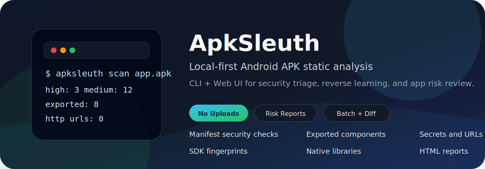
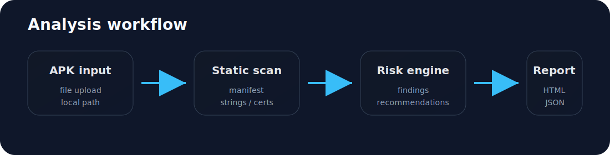
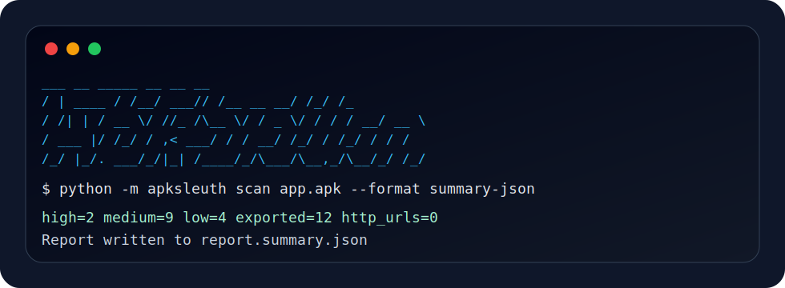
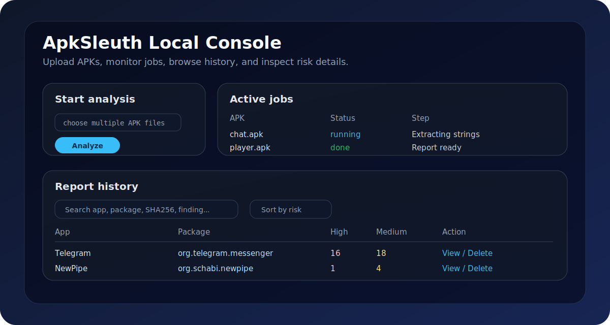

# ApkSleuth

**Languages:** English | [简体中文](README.zh-CN.md)

<p align="center">
  
</p>

<p align="center">
  
  
  
  
</p>

<p align="center">
  <strong>Analyze APKs locally, triage risk fast, and export reports for humans or automation.</strong>
</p>

ApkSleuth is a local-first Android APK static analysis tool for security review, reverse-engineering learning, Android development checks, and app risk triage.

It extracts APK metadata, Manifest configuration, permissions, exported components, URLs, IPs, emails, possible secrets, certificates, native libraries, SDK fingerprints, packer hints, and security findings. It can generate JSON, Markdown, HTML, short summary reports, structured summary JSON, batch indexes, and APK diff reports.

APK files are analyzed locally by default. ApkSleuth does not upload APKs and does not require an account.

## Visual Overview

<p align="center">
  
</p>

| CLI workflow | Local Web UI |
| --- | --- |
|  |  |

## At a Glance

| Area | What ApkSleuth does |
| --- | --- |
| Static analysis | Parses Manifest, resources, permissions, strings, certificates, native libraries, SDKs, and packer hints. |
| Risk triage | Groups findings by severity and prioritizes high-risk items before noisy low-risk signals. |
| Reporting | Exports summary Markdown, structured JSON, full JSON, and interactive HTML reports. |
| Web UI | Uploads one or many APKs, tracks background jobs, searches history, sorts by risk, and cleans up managed uploads. |
| Automation | Provides `summary-json`, batch `index.json`, and APK diff JSON for downstream tooling. |

## Highlights

- Local APK static analysis with no external service dependency.
- Pure Python Manifest parsing, including Android Binary XML support.
- `resources.arsc` string resolution for common Manifest resource references.
- Permission classification and high-risk permission detection.
- Exported component analysis for Activity, Service, Receiver, Provider, Deep Link, protected component, media component, and launcher-entry noise reduction.
- Manifest security checks for `debuggable`, `allowBackup`, `usesCleartextTraffic`, and network security config signals.
- URL, IP, email, JWT, Base64, and possible hardcoded secret extraction with noise filtering for licenses, docs, schemas, SVG metadata, fonts, and certificate bundles.
- V1 / V2 / V3 APK signature scheme detection, with optional X.509 certificate detail parsing.
- Native library ABI, size, and hash summaries.
- SDK and packer / obfuscation fingerprint detection.
- CLI reports in `json`, `markdown`, `html`, `summary`, and `summary-json` formats.
- HTML reports with finding search, severity filtering, match counts, and collapsible sections.
- Local Web UI with APK upload, multi-file batch upload, background jobs, status polling, report history, search, risk sorting, delete cleanup, and detailed report pages.
- Batch scanning with risk ranking and machine-readable index output.
- APK diff reports for version, permission, component, URL, SDK, native library, and signature changes.

## Project Status

ApkSleuth is an early-stage security tooling project. The built-in rules are intentionally conservative and should be treated as static-analysis signals, not final vulnerability proof.

Use the reports as a triage layer before manual review.

## Installation

Python 3.10 or later is required.

```bash
python -m pip install -e .
```

Optional certificate parsing support:

```bash
python -m pip install -e ".[certificates]"
```

Development extras:

```bash
python -m pip install -e ".[dev]"
```

## CLI Usage

Show help:

```bash
python -m apksleuth --help
python -m apksleuth scan --help
```

Generate a short human-readable summary:

```bash
python -m apksleuth scan path/to/app.apk --format summary --output report.summary.md
```

Generate a single-file HTML report:

```bash
python -m apksleuth scan path/to/app.apk --format html --output report.html
```

Generate full machine-readable JSON:

```bash
python -m apksleuth scan path/to/app.apk --format json --output report.json
```

Generate structured summary JSON for automation or Web UI ingestion:

```bash
python -m apksleuth scan path/to/app.apk --format summary-json --output report.summary.json
```

Show scan progress for large APKs:

```bash
python -m apksleuth scan path/to/app.apk --format summary --output report.summary.md --progress
```

The CLI prints a small ApkSleuth logo to `stderr` when a command runs. Report data remains on `stdout` or in the output file, so JSON and other machine-readable output are not polluted.

## Batch Scanning

Analyze all APK files in a directory and create an index:

```bash
python -m apksleuth batch path/to/apks --output reports --format summary-json --lang zh --progress
```

Recursive scan:

```bash
python -m apksleuth batch path/to/apks --output reports --recursive
```

Batch output includes:

- Per-APK reports.
- `index.md` for human-readable overview and risk ranking.
- `index.json` for automation and downstream tools.

## APK Diff

Compare two APK versions:

```bash
python -m apksleuth diff path/to/old.apk path/to/new.apk --format summary --output diff.md --lang zh
```

Generate structured diff JSON:

```bash
python -m apksleuth diff path/to/old.apk path/to/new.apk --format summary-json --output diff.json
```

The diff report compares:

- Version and APK metadata changes.
- Risk count deltas.
- Permission additions and removals.
- Component additions and removals.
- URL additions and removals.
- SDK additions and removals.
- Native library additions and removals.
- Signature scheme changes.

## Web UI

Start the local Web UI:

```bash
python -m apksleuth web --host 127.0.0.1 --port 8765 --open
```

The Web UI listens on `127.0.0.1` by default. Uploads and generated reports are stored under `.apksleuth-web/`.

Web UI features:

- Upload one or multiple APK files.
- Enter one or multiple local APK paths, one per line.
- Run analysis in background jobs with status polling.
- View current active jobs on the home page.
- Browse report history.
- Search history by app, package, version, SHA256, or finding keywords.
- Sort history by newest, overall risk, high findings, medium findings, total findings, or app name.
- Delete history records and clean up managed upload copies.
- View detailed analysis pages with finding search, severity filtering, exported component samples, HTTP URL samples, possible secret samples, SDK fingerprints, packer hints, recommendations, and parser notes.
- Download HTML, Markdown summary, structured summary JSON, and full JSON reports.

## Report Formats

- `summary`: concise Markdown report for quick manual review.
- `summary-json`: structured summary for Web UI, batch workflows, and automation.
- `html`: single-file interactive HTML report.
- `markdown`: full Markdown report.
- `json`: full machine-readable analysis data.

## Report Content

Reports may include:

- APK overview and hashes.
- Risk summary and overall verdict.
- Manifest security checks.
- Permission analysis.
- Exported component analysis.
- Deep Link and Provider signals.
- Network artifacts.
- Possible secrets.
- Certificate and signature scheme information.
- Native libraries.
- SDK fingerprints.
- Packer / obfuscation hints.
- Prioritized recommendations.
- Parser notes and limitations.

## Language

Chinese is the default report language:

```bash
python -m apksleuth scan path/to/app.apk --format summary --output report.zh.md --lang zh
```

English reports are also supported:

```bash
python -m apksleuth scan path/to/app.apk --format summary --output report.en.md --lang en
python -m apksleuth scan path/to/app.apk --format html --output report.en.html --lang en
```

JSON field names remain English for stable machine parsing.

## Repository Hygiene

This repository intentionally does not track APK samples, generated reports, Web UI work directories, batch output, or Python bytecode.

Ignored local artifacts include:

- `*.apk`, `*.aab`, `*.apks`
- `.apksleuth-web/`
- `.apksleuth-web-test/`
- `batch-reports/`
- generated `report*`, `summary*`, and `diff*` files
- `__pycache__/` and `*.pyc`

Keep real APK samples and report output outside commits unless there is a deliberate reason to add a small synthetic fixture.

## Development

Run the test suite:

```bash
python -m unittest discover
```

Run syntax compilation checks:

```bash
python -m compileall apksleuth tests
```

Recommended local verification before committing:

```bash
python -m unittest discover
python -m compileall apksleuth tests
```

## Safety and Scope

ApkSleuth is intended for authorized testing, app security review, reverse-engineering education, and defensive risk analysis.

This project does not provide cracking, piracy, login bypass, payment bypass, authorization bypass, fraud-control bypass, SSL pinning bypass, or unauthorized dynamic hooking functionality.

Static analysis has limits. Findings should be reviewed with app context, business logic, runtime behavior, and authorization boundaries in mind.

## Roadmap

- More precise exported component rules and Android framework component modeling.
- Better Deep Link reporting with scheme, host, path, and sample route grouping.
- More SDK and packer fingerprints for Android ecosystems.
- Custom rule support through YAML or JSON definitions.
- HTML diff reports.
- Historical trend views in the Web UI.
- Report snapshot tests based on small synthetic APK fixtures.
- Optional FastAPI-based Web UI backend for larger deployments.

## License

ApkSleuth is released under the MIT License. See [LICENSE](LICENSE).
